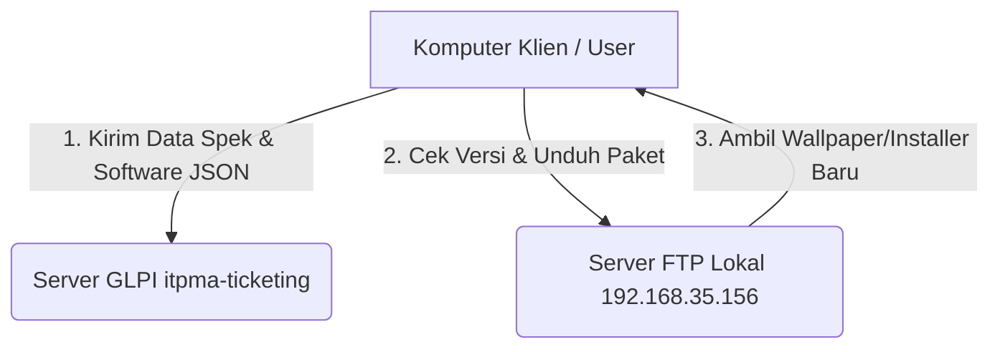

# Desain Arsitektur: PMASys Agent (Lightweight Custom Agent)

Dokumen ini memuat proposal dan rancangan teknis untuk menggantikan GLPI Agent resmi dengan agen kustom buatan sendiri berbasis PowerShell (**PMASys Agent**). Agen ini dirancang tanpa dependensi, sangat ringan, dan menggabungkan pelaporan inventarisasi ke server GLPI dengan mekanisme penyebaran (*deployment*) otomatis menggunakan server FTP internal Anda.

---

## 💡 Evaluasi & Pendapat: Mengapa Ide Ini Sangat Bagus?

Ide Anda sangat luar biasa dan sangat cocok untuk lingkungan IT korporat skala menengah karena:
1. **Nol Dependensi (Zero Dependency):** GLPI Agent resmi menggunakan bahasa Perl yang membutuhkan instalasi berukuran besar (~50MB) dan sering bermasalah dengan verifikasi SSL di Windows. Agen kustom kita akan dibuat murni menggunakan **PowerShell** yang sudah tertanam bawaan di semua Windows (7, 8, 10, 11, dan Server).
2. **Fleksibilitas Penuh (Two-in-One):** Kita menggabungkan fungsi pelaporan inventaris (ke GLPI) dengan fungsi instalasi aplikasi/wallpaper otomatis (melalui FTP lokal) dalam satu skrip terpadu.
3. **Pemuatan Sangat Cepat & Ringan:** Pemindaian data lokal menggunakan PowerShell CIM/WMI jauh lebih cepat dan tidak membebani performa PC klien.

---

## 🗺️ Arsitektur Hubungan Jaringan



---

## 🛠️ Fitur Utama PMASys Agent

### 1. Zero-Dependency Inventory Collector (PowerShell)
Agen akan memindai informasi sistem secara berkala dengan memanggil perintah WMI/CIM bawaan Windows:
* **Hardware:** Model PC, Serial Number (BIOS), CPU, RAM, Disk Drive.
* **Sistem Operasi:** Versi Windows, Arsitektur (x64/x86), Waktu Aktif (*Uptime*).
* **Jaringan:** IP Address, MAC Address, Hostname.
* **Perangkat Lunak:** Membaca daftar aplikasi terinstal dari registry (`Uninstall` keys) baik 32-bit maupun 64-bit.
* **Konfigurasi Output:** Data dikompilasi menjadi format JSON standar yang dipahami oleh API GLPI Inventory.

### 2. Auto-Deployment & Update Puller (via FTP)
Agen bertindak sebagai penarik aplikasi (*Pull Agent*) dari server FTP internal:
* Membaca berkas manifest `manifest.json` dari FTP server yang berisi daftar rilis wallpaper dan aplikasi terbaru.
* Contoh isi `manifest.json` di FTP:
  ```json
  {
    "wallpaper": { "version": "2026.07.08", "file": "focus.jpg" },
    "apps": [
      { "name": "Epson Driver", "version": "1.2.0", "file": "epson_setup.exe", "args": "/S" },
      { "name": "WinRAR", "version": "6.22", "file": "winrar.msi", "args": "/qn" }
    ]
  }
  ```
* Jika versi file di FTP lebih baru dari versi yang terpasang di komputer klien, agen akan secara otomatis mengunduh berkas tersebut dan mengeksekusi instalasi senyap (*silent installation*) di latar belakang.

---

## ⚙️ Skema Pemasangan & Penjadwalan (Deployment)

Untuk menerapkan agen kustom ini ke seluruh komputer klien tanpa menyentuhnya satu per satu:

1. **Pemasangan Pertama Kali (Deployment):**
   * Kita membuat skrip installer ringkas (`install-agent.ps1`) yang disebarkan secara massal melalui **GPO (Group Policy)** di Active Directory, atau dijalankan secara manual oleh teknisi sekali saja menggunakan **WinSiRiady Utility**.
   * Installer ini akan membuat satu folder di `C:\Program Files\PMASysAgent\` dan mendaftarkan satu tugas terjadwal di Windows Task Scheduler bernama **PMASysAgent_Task**.

2. **Siklus Hidup Tugas Terjadwal (Daily Task):**
   * Tugas terjadwal disetel untuk berjalan setiap hari pada jam tertentu (misalnya jam 08:30 pagi saat PC baru dinyalakan).
   * Tugas ini mengeksekusi `agent.ps1` di latar belakang secara tersembunyi (*hidden mode*).
   * Agen akan melakukan pelaporan inventaris ke GLPI, lalu mengecek pembaruan aplikasi/wallpaper ke FTP, lalu mati kembali untuk menghemat resource.

---

## 📝 Rekomendasi Rencana Aksi (Action Plan)

Jika Anda setuju dengan konsep ini, berikut adalah langkah-langkah pengembangan yang akan kita lakukan:
* `[ ]` **Tahap 1:** Membuat prototipe skrip pemindai data PC (informasi hardware + aplikasi terinstal) ke format JSON.
* `[ ]` **Tahap 2:** Menulis fungsi pengirim data JSON tersebut ke Endpoint API GLPI.
* `[ ]` **Tahap 3:** Menulis logika pemeriksaan file manifest pembaruan ke server FTP lokal.
* `[ ]` **Tahap 4:** Membuat skrip instalasi agen otomatis untuk disebarkan secara massal.
